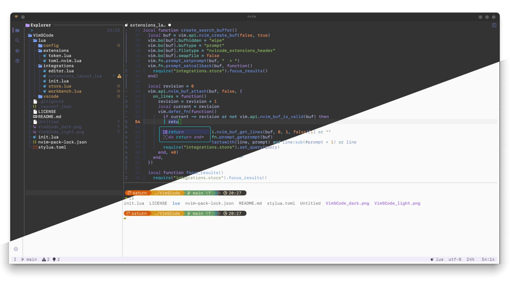

# VimSCode

I made this so it has a VSCode feel to it. 
Neovim is awesome and extremly powerful but i feel that many of its features could be more accessible.



## install

back up your old neovim config, then run:

```sh
git clone https://github.com/SudoSaturn/VimSCode ~/.config/nvim
nvim
```

plugins install automatically the first time through Neovim's native
`vim.pack` API and are configured by this project's own integration modules.

use `:Store` for the extension marketplace, `:packupdate` for native package
updates, `:Mason` for language tools, and `Ctrl+Shift+P` for the command palette.

## workbench keys

- `Ctrl+B` toggles the primary side bar
- `Ctrl+Shift+E/F/G/D/X` opens Explorer, Search, Source Control, Run/Debug, or Extensions
- `Ctrl+P` opens files and `Ctrl+Shift+P` opens the command palette
- `Ctrl+,` opens settings and `Ctrl+K Ctrl+S` searches keyboard shortcuts
- `Ctrl+backtick` toggles the integrated terminal

Any terminal using the Kitty keyboard logic should automatically detected (eg: Ghostty, Alacritty).
I am doing this project on a 13 year old thinkpad while moving my studio 
so i will be able to test more throughly once i can use my main machine.

Please let me know what is broken or messed up and ill make time to fix it up :)

